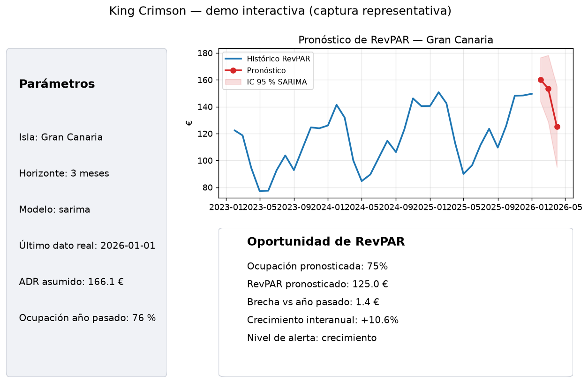
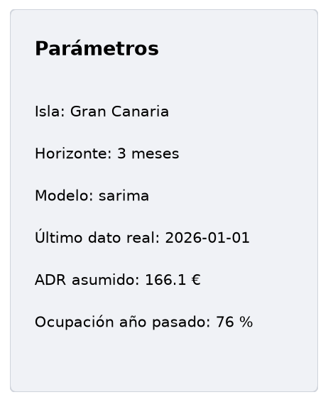
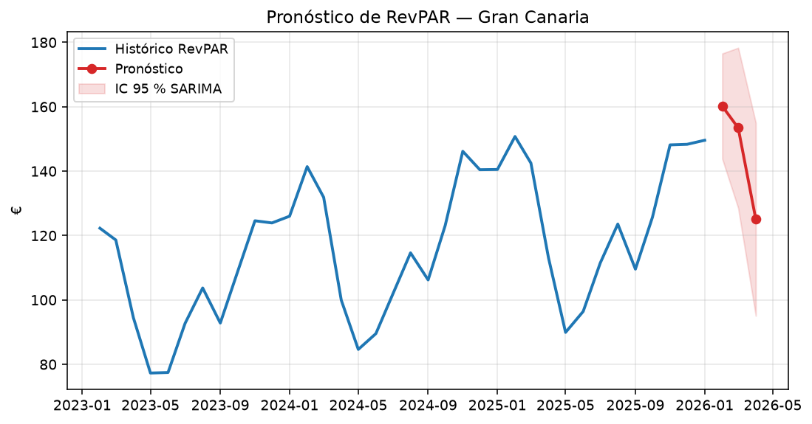
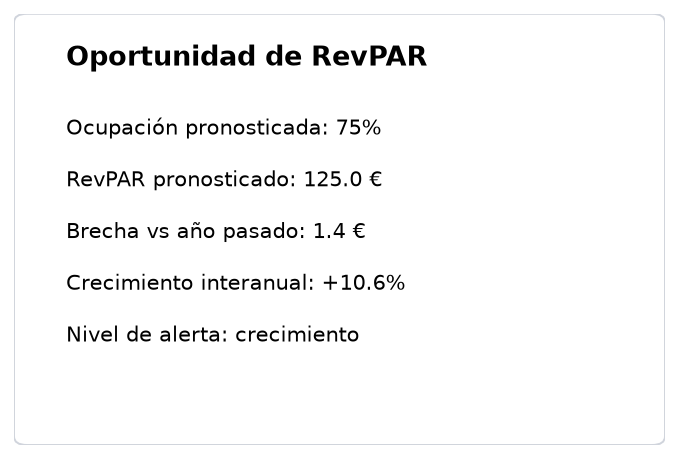
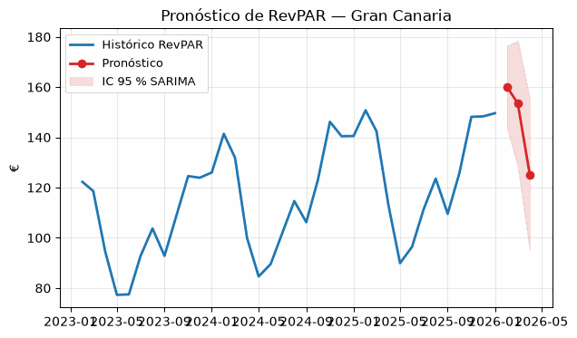
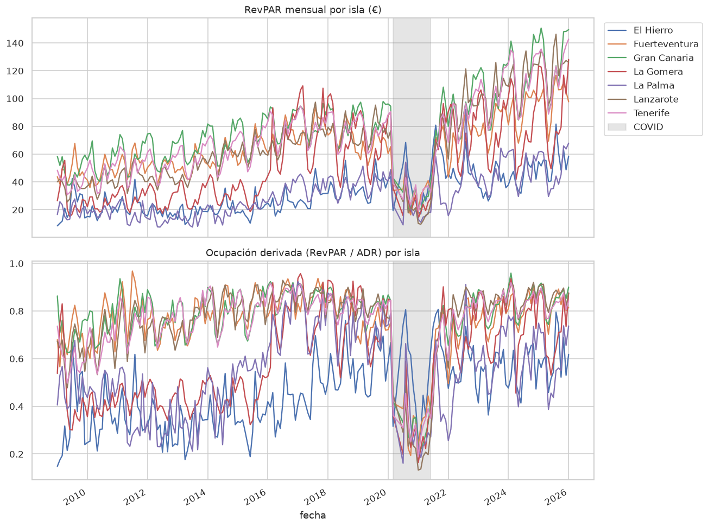
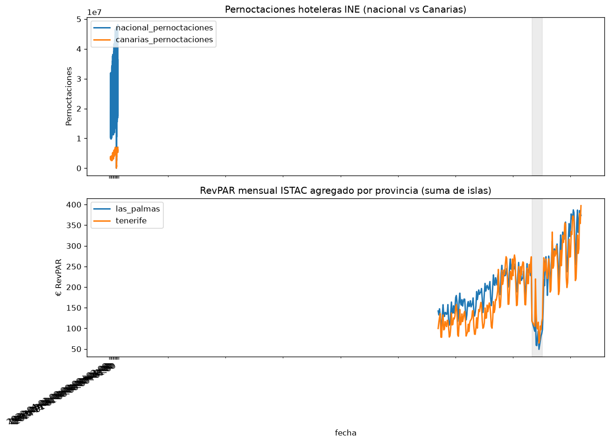
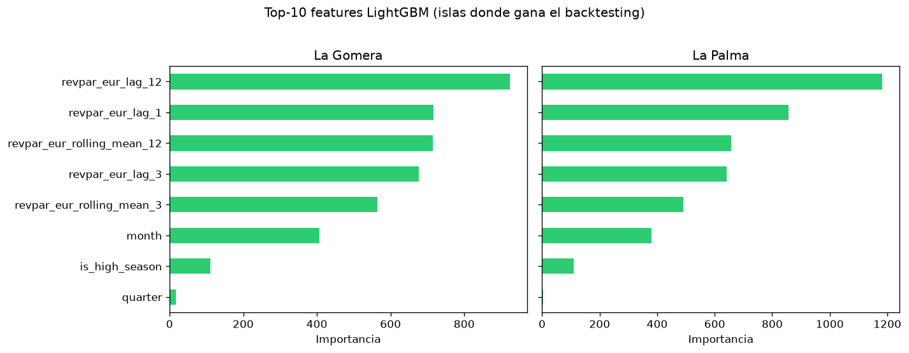

# King Crimson ⏳

> King Crimson, el Stand de Diavolo, borra un tramo de tiempo entre una acción y su
> resultado — así "ya sabe" cómo termina algo antes de que pase. Este proyecto hace lo
> mismo con la demanda turística: se adelanta al resultado (la ocupación/RevPAR del mes
> que viene) antes de que llegue.

*(Nombre cambiado desde la versión inicial "Weather Report" — ya en uso en otro
repositorio del autor para predicción meteorológica real, para evitar confusión.)*

Proyecto de Data Science de forecasting de series temporales: pernoctaciones/ocupación
turística por isla, usando **datos abiertos oficiales** (ISTAC + INE), no un dataset de
Kaggle. Es la pieza de portfolio más original de las tres — nadie más la va a tener con
exactamente esta fuente ni esta geografía.

**Demo en vivo:** [canary-islands-tourism-forecast.streamlit.app](https://canary-islands-tourism-forecast.streamlit.app/)

## Estado del proyecto

✅ **Ejecutado de extremo a extremo con datos reales.** Cubo ISTAC `C00065A_000003`
descargado y armonizado (205 meses, 2009-2026, 7 islas), backtesting completo
(357 folds de ventana expansiva), modelos entrenados y serializados, e informe de
negocio y app de Streamlit conectados a esos modelos reales — sin placeholders.
Desplegada en [Streamlit Community Cloud](https://canary-islands-tourism-forecast.streamlit.app/).
Corre entero en un venv normal, sin Docker ni Spark. Detalle de cómo se ejecutó
y qué se encontró en `docs/ROADMAP.md`.

## Objetivo

1. Pronosticar pernoctaciones/ocupación mensual por isla con un horizonte de 3-6 meses.
2. Comparar un baseline de series temporales (naive estacional) contra SARIMA y un modelo
   de gradient boosting con features de calendario y rezagos.
3. Traducir el pronóstico a **oportunidad de RevPAR** — si se sabe con antelación que
   viene un mes flojo de demanda, hay margen de reacción en pricing (mismo concepto de
   ADR × Ocupación que ya se usa en ADS/NDMI).
4. Demo interactiva: elegir isla y horizonte, ver el pronóstico con intervalo de confianza.

## Demo (capturas)



| Panel | Descripción |
|---|---|
|  | Selector de isla, horizonte, ADR y ocupación año pasado |
|  | RevPAR histórico + pronóstico con intervalo de confianza (SARIMA) |
|  | Brecha de RevPAR, YoY y nivel de alerta de demanda |



Post de portfolio (2 min): [`docs/portfolio_post.md`](docs/portfolio_post.md)

## Fuentes de datos (reales, verificadas — ver `data/README.md` para el detalle completo)

- **ISTAC** (Instituto Canario de Estadística) — cubos estadísticos con descarga directa
  en CSV/JSON: pernoctaciones/viajeros por isla, y tarifa media diaria (ADR)/RevPAR/ingresos
  por isla, con series mensuales desde 2009.
- **INE** (Encuesta de Ocupación Hotelera) — serie nacional por provincia (Las Palmas /
  Santa Cruz de Tenerife), vía API Tempus3, para contrastar Canarias contra la tendencia
  nacional. Ver `notebooks/05_ine_contrast.ipynb`.

## Estructura

```
king-crimson/
├── data/
│   ├── raw/                 Descargas originales de ISTAC/INE — gitignored
│   ├── processed/           Series ya armonizadas a formato largo (fecha, isla, indicador)
│   └── README.md            Fuentes exactas, URLs de descarga, esquema esperado
├── notebooks/
│   ├── 01_eda.ipynb                     Carga + armonización + primera exploración
│   ├── 02_decomposition_features.ipynb  Descomposición estacional + features de calendario/rezagos
│   ├── 03_modeling.ipynb                Naive estacional vs SARIMA vs LightGBM, backtesting temporal
│   ├── 04_business_report.ipynb         Traducción a € de oportunidad de RevPAR
│   └── 05_ine_contrast.ipynb            Contraste pernoctaciones INE vs RevPAR ISTAC
├── src/
│   ├── data.py               Carga y armonización de las series
│   ├── features.py           Features de calendario, rezagos, medias móviles
│   ├── ine.py                  Descarga series INE (tabla EOH 67190)
│   ├── model.py                Modelos + validación cruzada temporal (sin fuga de futuro)
│   └── business.py             Pronóstico → oportunidad de RevPAR
├── app/
│   └── streamlit_app.py       Demo: isla + horizonte → pronóstico con intervalo
├── docker/
│   └── Dockerfile             Contenedor opcional solo para la app Streamlit
├── scripts/                   Runners reproducibles (notebooks, métricas, figuras)
├── models/                    Modelos entrenados (uno por isla) + registry.json — gitignored
├── reports/figures/            Gráficos versionados para README/portfolio
├── tests/                      39 tests (business/data/features/model/ine) — no necesitan datos reales
└── docs/
    ├── ROADMAP.md              Plan de preparación + resultados reales de la ejecución
    ├── portfolio_post.md       Narrativa de 2 min para LinkedIn/dev.to
    └── ejecucion_resultados.md   Salida celda a celda de la última ejecución
```

## Stack

Python · pandas · statsmodels (SARIMA) · LightGBM · scikit-learn · matplotlib/seaborn ·
Streamlit · pytest. Sin infraestructura pesada.

## Resultados reales (backtesting, 357 folds de ventana expansiva, horizonte 3 meses)

| Modelo | MAE (€) | RMSE (€) | MAPE | MAPE ex-COVID | Cobertura IC 95 % |
|---|---|---|---|---|---|
| Naive estacional (baseline obligatorio) | 12.6 | 13.7 | 29.8% | 17.0% | — |
| SARIMA(1,1,1)(1,1,1,12) | 8.1 | 9.0 | **18.3%** | **13.2%** | **85.1%** |
| LightGBM (calendario + rezagos + medias móviles) | 8.3 | 9.4 | 18.0% | 13.3% | — |

Ambos modelos le ganan claramente al naive (regla de oro del proyecto: si no le
ganan, no aportan nada). SARIMA gana en 5 de 7 islas grandes/medianas; LightGBM
gana en las 2 islas más pequeñas y volátiles (La Gomera, La Palma) — ver
`reports/figures/03_comparacion_modelos_por_isla.png`. El MAPE global incluye a
propósito la ruptura de COVID (2020-2021) dentro del propio backtest; la columna
**MAPE ex-COVID** aísla el error estructural del modelo.

Hallazgo de EDA que sí cambió el código: los meses de temporada alta reales
(agosto, noviembre, febrero, marzo, septiembre, enero) no coinciden del todo con
la intuición inicial de `HIGH_SEASON_MONTHS` (asumía julio y diciembre en vez de
septiembre y noviembre) — corregido en `src/features.py` con el dato real.







## Cómo correrlo

```bash
make install    # venv + dependencias
make test       # 39 tests
make metrics    # backtesting extendido (~15 min) → data/processed/model_eval_summary.csv
make notebooks  # pipeline completo notebooks 01-04
make reports    # capturas demo + figuras INE + feature importance
make app        # Streamlit local (o abrir la demo desplegada arriba)
make docker-build && make docker-run   # app en contenedor (monta models/ y data/processed/)
```

Equivalente manual:

```bash
python3 -m venv .venv && source .venv/bin/activate
pip install -r requirements.txt
python scripts/execute_and_report.py   # notebooks en orden (cwd correcto)
pytest tests/ -v
streamlit run app/streamlit_app.py
```

## Roadmap

Ver `docs/ROADMAP.md`.
